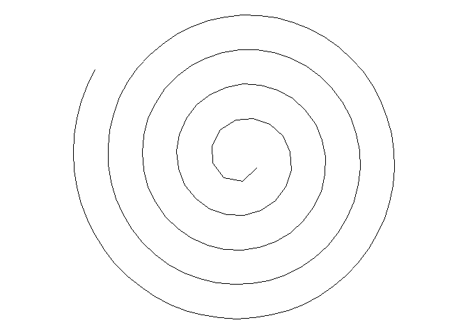
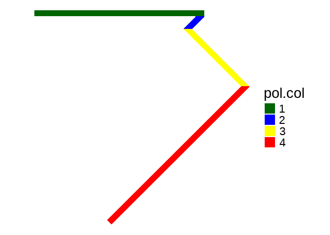
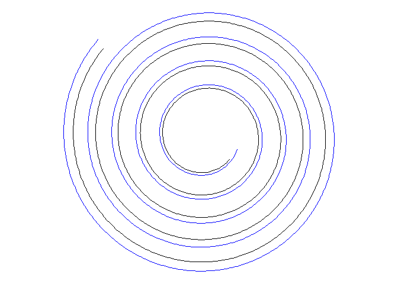
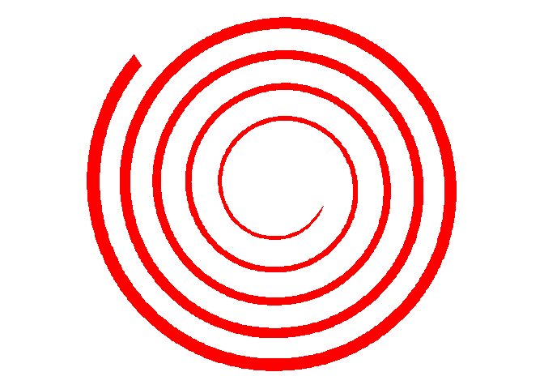
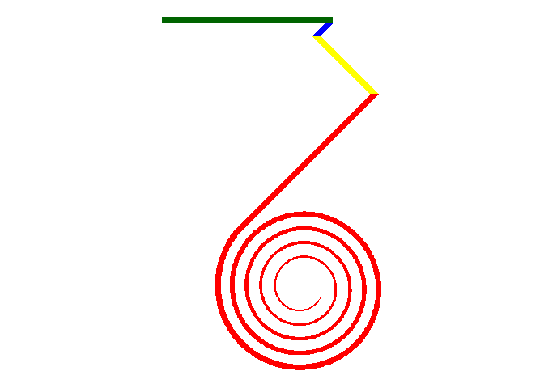
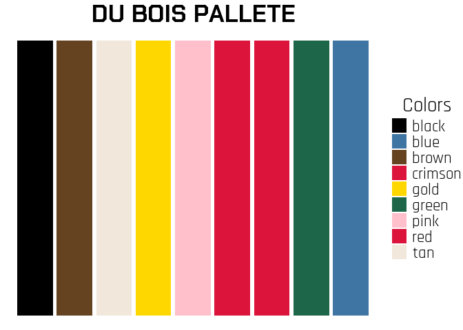

```r
# Load package
library(tidyverse)
library(here)
library(ggtext)
library(ggforce)
library(showtext)
library(magick)

font_add_google("Chakra Petch", "cp")
font_add_google("Quantico")
font_add_google("Rajdhani")
showtext.auto()
showtext_opts(dpi = 192)
```


```r
city_rural <- readr::read_csv('https://raw.githubusercontent.com/rfordatascience/tidytuesday/master/data/2021/2021-02-16/city_rural.csv')
```

The image to be re-created is:


I choose this plate due to the challenge of make an spiral, so I will start by  drafting a spiral. 

I found this [blog post](http://www.ryantimpe.com/post/spiral1/), that have a function to make a spiral. Then, I made some changes in the function, I removed the image argument it had, and switched the sine and cosine function from x to y, which alters the sense of the spiral from clockwise to counter-clockwise.


```r
# Function for equidistant points on a spiral

spiral_cartesian <- function(
  spiral_radius, 
  num_coils, 
  chord_length, 
  rotation){
  
  
  #Derive additional spiral specifications
  centerX <- 0
  centerY <- 0
  
  thetaMax <- num_coils * 2 * pi
  awayStep <- spiral_radius / thetaMax
  
  #While loop to keep drawing spiral until we hit thetaMax
  spiral <- tibble()
  theta <- chord_length/awayStep
  
  while(theta <= thetaMax){
    #How far away from center
    away = awayStep * theta
    
    #How far around the center
    around = theta + rotation
    
    #Convert 'around' and 'away' to X and Y.
    x = centerX + sin(around) * away
    y = centerY + cos(around) * away
    
    spiral <- spiral %>% 
      bind_rows(tibble(x=x, y=y))
    
    theta = theta + chord_length/away
  }
  
  return(spiral)
}


spiral_cartesian(20, 5, 2, -1) %>% 
  ggplot(aes(x=x, y=y)) +
  geom_path() +
  coord_fixed() + #Not polar!
  theme_void()
```

<!-- -->

Lets create the polygons above the spiral.

The creation of the polygons was very manual! Based on basic trigonometry, I cauculated the diagonals and the position of the polygon segments.


```r
side1 <- city_rural$Population[2]/sqrt(2)
side2 <- city_rural$Population[3]/sqrt(2)
side3 <- 90000/sqrt(2)

y.init <- 150000
width <- 2750
width45 <- width*sqrt(2)
width45inv <- width/sqrt(2)

y <- c(y.init, 
       y.init,
       y.init + width, 
       y.init + width,
       y.init,
       y.init-side1,
       y.init-side1,
       y.init,
       y.init-side1, 
       y.init-side1-side2,
       y.init-side1-side2,
       y.init-side1,
       y.init-side1-side2,
       y.init-side1-side2-side3,
       y.init-side1-side2-side3+width45inv,
       y.init-side1-side2)

x.init <- city_rural$Population[1]
x <- c(0, 
       x.init,
       x.init,
       0,
       x.init, 
       x.init-side1,
       x.init-side1 - width45,
       x.init - width45,
       x.init-side1, 
       x.init-side1+side2,
       x.init-side1+side2 - width45,
       x.init-side1 - width45,
       x.init-side1+side2,
       x.init-side1+side2-side3,
       x.init-side1+side2-side3 - width45inv,
       x.init-side1+side2 - width45)

pol.col <- c(rep("1", 4),
             rep("2", 4),
             rep("3", 4), 
             rep("4", 4))

path.line <- tibble(x, y, pol.col)

ggplot(path.line, aes(x = x, y=y)) +
  geom_polygon(aes(group = pol.col, fill = pol.col)) +
  scale_fill_manual(values = c("darkgreen", "blue", "yellow", "red")) +
  coord_fixed()+ #Not polar!
  theme_void()
```

<!-- -->


Now, I create the polygon for the spiral.


```r
spiral1 <- 
spiral_cartesian(
  spiral_radius = city_rural$Population[3], 
  num_coils = 6, 
  chord_length = 500, 
  rotation = -sin(45)) %>% 
tail(1332)

spiral2 <- 
spiral_cartesian(
  spiral_radius = city_rural$Population[3] + width, 
  num_coils = 6, 
  chord_length = 500, 
  rotation = -sin(44.95)) %>% 
tail(1436)

spiral1 %>% 
  ggplot(aes(x=x, y=y)) +
  geom_path() +
  geom_path(data = spiral2, aes(x=x, y=y), color = "blue") +
  coord_fixed() + #Not polar!
  theme_void()
```

<!-- -->

```r
spiral_pol <- bind_rows(spiral1, spiral2[nrow(spiral2):1,])
spiral_pol$pol.col <- "5"

ggplot(spiral_pol, aes(x = x, y=y)) +
  geom_polygon(fill = "red") +
  coord_fixed()+ 
  theme_void()
```

<!-- -->

Now, I join the geometries in the same graph.


```r
spiral_pos <-  path.line[14,1:2] - spiral_pol[1332,1:2]

path.line2 <- 
path.line %>% 
  mutate(x = x - spiral_pos$x, 
         y = y - spiral_pos$y)

du_bois_pol <- bind_rows(path.line2, spiral_pol)


ggplot(du_bois_pol, aes(x = x, y=y)) +
  geom_polygon(aes(group = pol.col, fill = pol.col), 
               show.legend = F) +
  scale_fill_manual(
    values = c("darkgreen", "blue", "yellow", "red", "red")
    ) +
  coord_fixed()+ #Not polar!
  theme_void() 
```

<!-- -->


Colors from: [here](https://raw.githubusercontent.com/ajstarks/dubois-data-portraits/master/dubois-style.pdf)

From this colors I change the green and the tan. For the tan, I changed only the
transparency, including the 50 after the hex color code. It is the same as use `alpha = 0.5`. 

```r
du_bois_colors <- c(
  black = "#000000",
  brown = "#654321",
  tan = "#d2b48c50",
  gold = "#ffd700",
  pink = "#ffc0cb",
  crimson = "#dc143c",
  red = "#dc143c", # it is the same of crimson
  green = "#1e6649",
  blue = "#3f75a2"
)

tibble(x = 1:9, y = rep(1, 9), col = names(du_bois_colors)) %>% 
  ggplot(aes(x = x, y = y, fill = col)) +
  geom_col() +
  scale_fill_manual(name = "Colors", values = du_bois_colors) +
  theme_void() +
  labs(title = "DU BOIS PALLETE") +
  theme(plot.title = element_text(hjust = 0.5, family = "cp", face = "bold"), 
        legend.title = element_text(hjust = 0.5, family = "Rajdhani"), 
        legend.text = element_text(family = "Rajdhani"))
```

<!-- -->


To place the text in the image, I save image at each step until have the final image as I wanted. 


```r
du_bois_pol <- 
du_bois_pol %>% 
  mutate(
    pol.col = str_replace_all(pol.col, pattern = "1", replacement = "green"),
    pol.col = str_replace_all(pol.col, pattern = "2", replacement = "blue"),
    pol.col = str_replace_all(pol.col, pattern = "3", replacement = "gold"),
    pol.col = str_replace_all(pol.col, pattern = "4", replacement = "crimson"),
    pol.col = str_replace_all(pol.col, pattern = "5", replacement = "red"))

p.title <- "CITY AND RURAL POPULATION.\n1890."

txt.1 <- "78,139 NEGROES IN CITIES\nOF OVER 10,000 INHABITANTS"
txt.2 <- "NEGROES IN CITIES\nFROM 5,000 TO 10,000"
txt.3 <- "37,699\nNEGROES\nIN CITIES\nFROM\n2,500 TO 5,000"
nun.txt.2 <- "8,025"
num.central <- "734,952"

gg_dubois <- 
ggplot(du_bois_pol, aes(x = x, y=y)) +
  geom_polygon(aes(group = pol.col, fill = pol.col), 
               show.legend = F) +
  scale_fill_manual(
    values = du_bois_colors
    ) +
  geom_text(
    aes(
      x = -40000, y = 117000, 
      label = txt.1, family = "Rajdhani"), 
      size = 5, vjust = 0.5, hjust = 0.5,
      lineheight = 0.4
    ) +
  geom_text(
      aes(
      x = 6000, y = 100000, 
      label = txt.3, family = "Rajdhani"), 
      size = 5, vjust = 0.5, hjust = 0.5,
      lineheight = 0.4
    ) +
  geom_text(
      aes(
      x = 20400, y = 117000, 
      label = txt.2, family = "Rajdhani"), 
      size = 5, vjust = 0.5, hjust = 0,
      lineheight = 0.4
    ) +
  geom_text(
    aes(
    x = 16000, y = 117000, 
    label = nun.txt.2, family = "Rajdhani"), 
    size = 5) +
  geom_text(
    aes(
    x = 0, y = 0, 
    label = num.central, family = "Rajdhani"), 
    size = 7
    ) +
  geom_text(
      aes(
      x = 0, y = -43000, 
      label = "NEGROES LIVING IN THE COUNTRY AND VILLAGES.",
      family = "Rajdhani"), 
      size = 5, vjust = 0.5, hjust = 0.5,
      lineheight = 0.4
    ) +
  coord_fixed() +
  theme_void() +
  xlim(-90000, 90000) +
  ylim(-100000, 140000) +
  labs(title = p.title) +
  theme(
    plot.title = element_text(
      family = "Quantico", 
      hjust = 0.5,
      size = 18, 
      lineheight = 0.5), 
    plot.background = element_rect(fill = du_bois_colors["tan"], color = NA), 
    plot.margin = margin(t = 20, r = 20, l = 20))


ggsave(
  here("2021", "week08", "dubois.png"),
  gg_dubois,
  width = 7,
  height = 9, 
  type = 'cairo'
)

image_read(here("2021", "week08", "dubois.png")) %>% 
  image_trim() %>% 
  image_write(here("2021", "week08", "dubois.png"))
```


Then the final re-creation:

