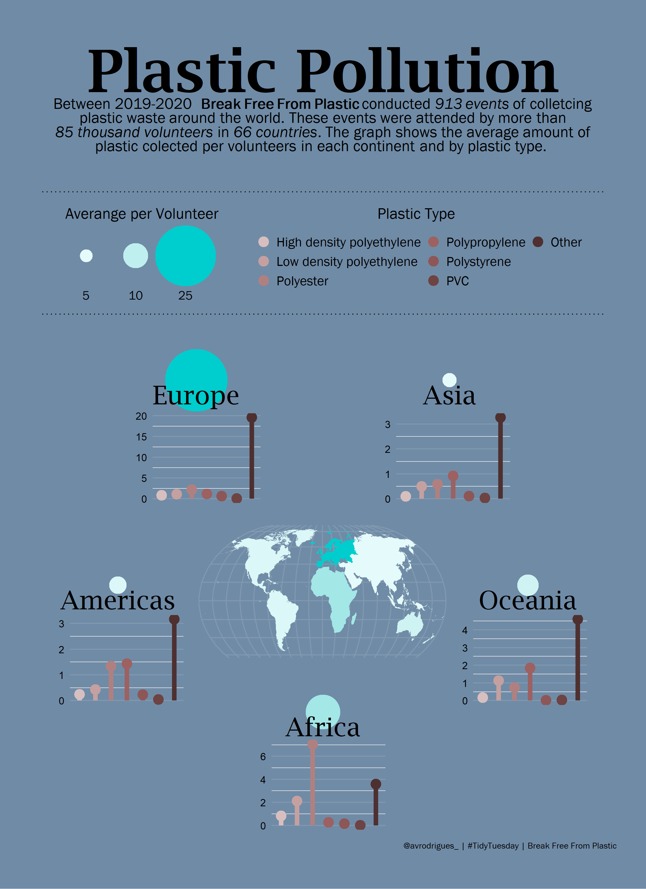
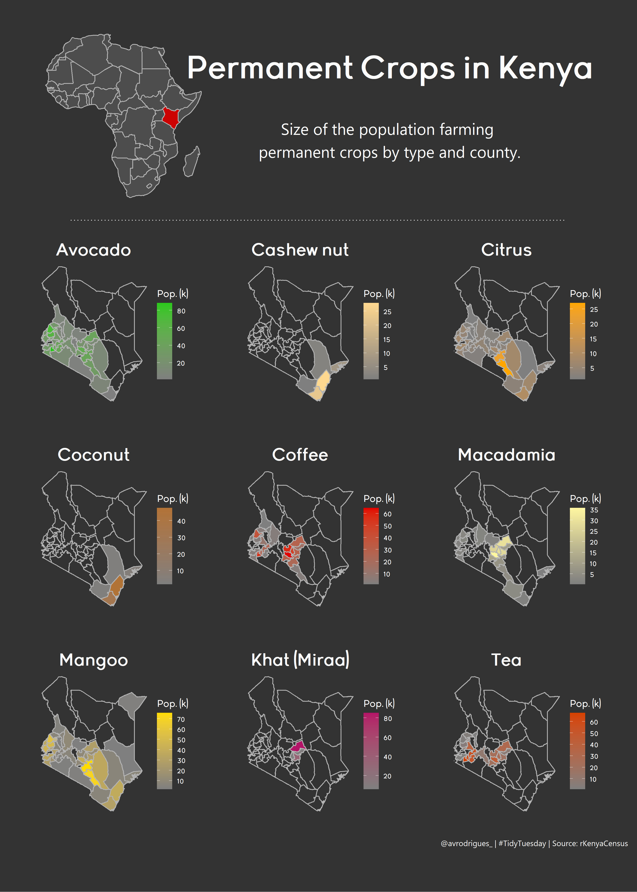
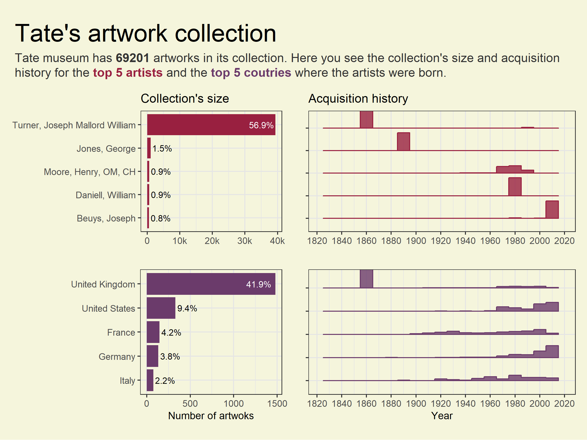
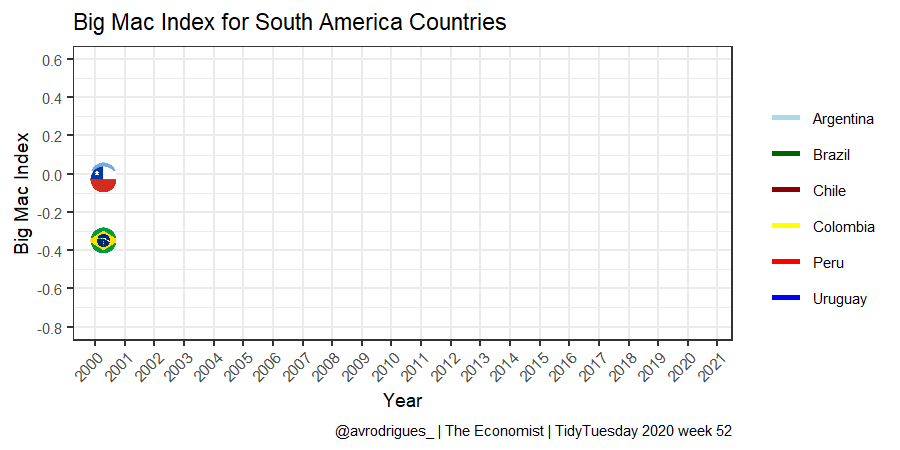

# Tidy_tuesday
My participation on [#TidyTuesday challenge](https://github.com/rfordatascience/tidytuesday)

---

Twitter: [@avrodrigues_](https://twitter.com/avrodrigues_)
Site: [avrodrigues.github.io/avr_site/](https://avrodrigues.github.io/avr_site/)

---

## 2021
### Week 05 - Break Free From Plastic
Plastic polltion found by volunteers in each continent

### Week 04 - rKenyaCensus package
People farming permanent crops in Kenya

### Week 03 - Tate Art Museum
Top 5 artists and countries in the Tate's artwork collection

### Week 02 - Transit Costs
Transit Costs in Americas

## 2020

### Week 52 - Big Mac Index
Big Mac Index for South American countries

### Week 51 - American Ninja
Diversity of obstable along season of American Ninja

### Week 50 - BBC's 100 women of 2020
The latin american women in the BBC's list.

### Week 49 - Toronto shelters
Montly average capacity of shelters system in Toronto, Canada.

### Week 48 - Washington Hike
Average elevation gain of trials in Whasington regions

